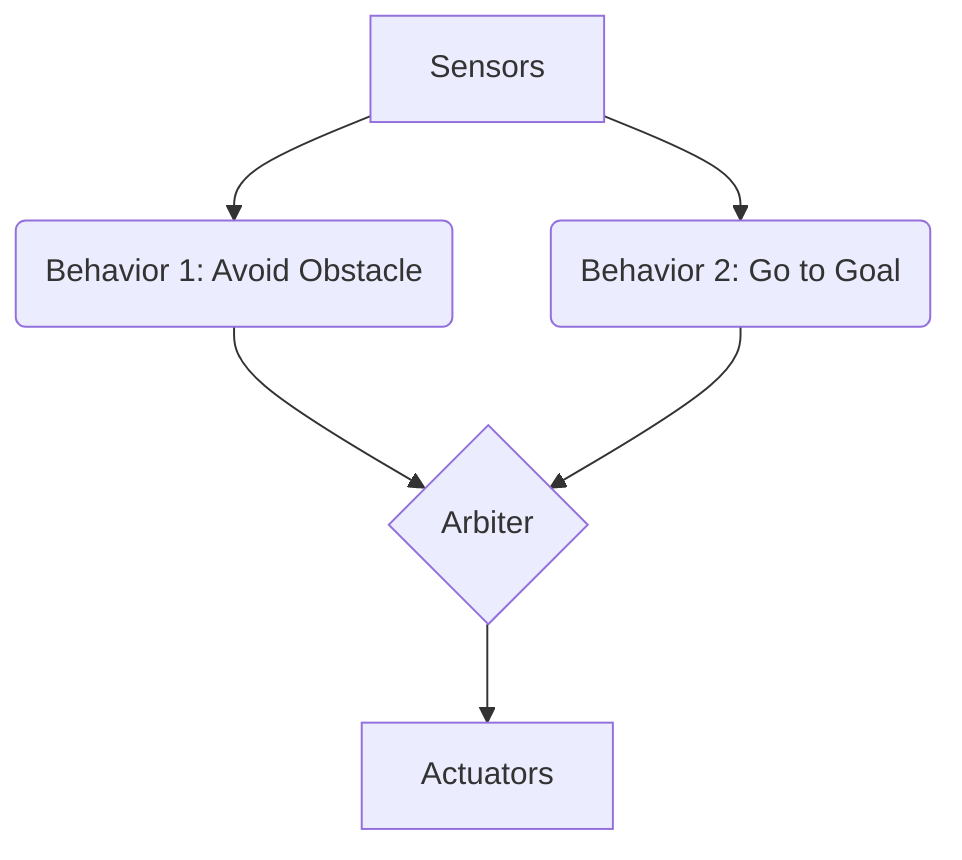

import { Tabs, TabItem } from '@astrojs/starlight/components';
import { Aside } from '@astrojs/starlight/components';

# Chapter 4: Robot Control Architectures

Robot control architectures are the organizational structures that dictate how a robot’s perception, cognition, and action systems interact. These architectures define the flow of information and control, influencing a robot's autonomy, adaptability, and performance in various environments. This chapter delves into the primary paradigms of robot control, exploring their principles, advantages, and limitations.

## 4.1 Fundamental Control Concepts

At the heart of robot control lie several key concepts.

### Sensing-Actuation Loop
The continuous cycle where a robot perceives its environment through sensors, processes this information, makes decisions, and then acts upon the environment through actuators. This feedback loop is essential for adaptive behavior.

### Modularity
Breaking down the control system into distinct, manageable modules, each responsible for a specific function (e.g., navigation, manipulation, vision). This promotes reusability and simplifies development.

### Hierarchy
A layered organization where higher levels deal with abstract goals and long-term planning, while lower levels handle immediate actions and sensorimotor control.

## 4.2 Reactive Control

Reactive architectures prioritize rapid response to immediate sensory input without explicit world models or complex planning. They are characterized by a direct mapping from sensor data to actuator commands.

### Principles
- No explicit world model.
- Fast, reflex-like responses.
- Behavior-based, often using a collection of simple behaviors that compete or cooperate.

### Examples
- **Braitenberg Vehicles:** Simple robots demonstrating complex-looking behaviors from basic sensor-motor connections.
- **Subsumption Architecture:** Developed by Rodney Brooks, it's a layered architecture where higher layers subsume the functions of lower layers, but lower layers can always take control if necessary for immediate survival.

```python
# Simple reactive behavior: Obstacle avoidance
def avoid_obstacle(sensor_data):
    if sensor_data['front_distance'] < 0.5:
        return {'linear_vel': 0.0, 'angular_vel': 0.5} # Turn right
    else:
        return {'linear_vel': 0.2, 'angular_vel': 0.0} # Move forward
```

<Aside type="note" title="Advantage">
Reactive systems are robust to dynamic environments and computationally inexpensive.
</Aside>

## 4.3 Deliberative Control

Deliberative architectures, also known as "sense-plan-act" paradigms, involve extensive planning based on an internal world model. They are suitable for tasks requiring reasoning, prediction, and goal-directed behavior.

### Principles
- Explicit world model.
- Planning module generates action sequences.
- Slow, sequential processing.

### Components
1.  **Perception:** Builds and updates the world model.
2.  **Modeling:** Maintains the internal representation of the environment.
3.  **Planning:** Generates a sequence of actions to achieve a goal.
4.  **Execution:** Carries out the planned actions.

<Aside type="caution" title="Limitation">
Deliberative systems can be slow and brittle in rapidly changing or uncertain environments due to the "frame problem" (difficulty in keeping the world model updated).
</Aside>

## 4.4 Hybrid Control

Hybrid architectures combine the strengths of both reactive and deliberative approaches. They typically feature a hierarchical structure with deliberative components at higher levels for long-term planning and reactive components at lower levels for immediate execution and local obstacle avoidance.

### Common Structure
- **Behavioral Layer:** Reactive, handles real-time tasks (e.g., obstacle avoidance, wall following).
- **Executive Layer:** Manages tasks, monitors execution, handles failures.
- **Deliberative Layer:** High-level planning, mission goals, world modeling.

## 4.5 Behavior-Based Control

Behavior-based robotics, a broader category that often includes reactive elements, emphasizes the emergence of intelligent behavior from the interaction of many simple, concurrent behaviors.

### Key Concepts
- **Behaviors:** Encapsulate specific goals (e.g., "wander," "avoid-collision," "go-to-goal").
- **Coordination:** Mechanisms for resolving conflicts and integrating outputs from multiple behaviors (e.g., arbitration, blending, subsumption).


_Figure 4.1: Simple Behavior Arbitration Diagram_

## 4.6 Task Planning

Task planning in robotics involves breaking down high-level goals into a sequence of executable actions. This often uses AI planning techniques to generate plans that satisfy constraints and achieve desired states.

### Approaches
- **Classical Planning:** Assumes deterministic actions, complete knowledge, and static worlds.
- **Hierarchical Task Networks (HTN):** Decomposes complex tasks into smaller subtasks, often used for human-like task execution.
- **Probabilistic Planning:** Deals with uncertainty in action outcomes and sensing.

## 4.7 Human-Robot Interaction (HRI) Control

HRI control architectures focus on enabling effective and intuitive collaboration between humans and robots. This involves designing systems that can understand human intent, adapt to human actions, and communicate effectively.

### Aspects
- **Shared Autonomy:** Dynamically allocating control between human and robot.
- **Intention Recognition:** Inferring human goals and preferences.
- **Natural Language Processing:** Enabling robots to understand and respond to verbal commands.

## 4.8 Implementation Considerations

Implementing robot control architectures involves selecting appropriate software frameworks and programming languages.

### Frameworks
- **ROS (Robot Operating System):** A widely used middleware providing tools, libraries, and conventions for building robot applications.
- **MoveIt!:** Integrated with ROS, provides motion planning functionalities.

### Languages
- **Python:** Popular for high-level control, AI, and rapid prototyping.
- **C++:** For performance-critical components and real-time control.

<Tabs>
  <TabItem title="Python Example">

  ```python
  # ROS Node for simple robot control
  import rospy
  from geometry_msgs.msg import Twist

  def move_robot():
      rospy.init_node('robot_mover', anonymous=True)
      pub = rospy.Publisher('/cmd_vel', Twist, queue_size=10)
      rate = rospy.Rate(10) # 10hz
      vel_msg = Twist()

      vel_msg.linear.x = 0.1
      vel_msg.angular.z = 0.0

      while not rospy.is_shutdown():
          pub.publish(vel_msg)
          rate.sleep()

  if __name__ == '__main__':
      try:
          move_robot()
      except rospy.ROSInterruptException:
          pass
  ```
  </TabItem>
  <TabItem title="C++ Snippet">
  ```cpp
  // Basic C++ structure for a control loop (conceptual)
  #include <iostream>

  class RobotController {
  public:
      void sense() { /* Read sensors */ }
      void deliberate() { /* Plan actions */ }
      void act() { /* Send commands to motors */ }

      void run() {
          while (true) {
              sense();
              deliberate();
              act();
          }
      }
  };

  int main() {
      RobotController controller;
      controller.run();
      return 0;
  }
  ```
  </TabItem>
</Tabs>

## 4.9 Challenges in Robot Control

Designing effective robot control architectures presents several challenges:

-   **Uncertainty:** Dealing with noisy sensors, unpredictable environments, and imprecise actuators.
-   **Scalability:** Managing complexity as robot capabilities and tasks grow.
-   **Robustness:** Ensuring reliable operation in diverse and challenging conditions.
-   **Real-time Performance:** Meeting timing constraints for dynamic interactions.

## 4.10 Summary

Robot control architectures are foundational to robotics, enabling machines to interact intelligently with the world. From the rapid responses of reactive systems to the reasoned actions of deliberative paradigms, and the nuanced integration of hybrid and behavior-based approaches, each architecture offers distinct advantages for different robotic applications. Understanding these structures is crucial for developing robust, autonomous, and intelligent robotic systems.

### Further Reading
- [Introduction to Robotics: Mechanics and Control](https://www.cs.cmu.edu/~rasc/old_stuff/references/Robotics-Craig.pdf)
- [Behavior-Based Robotics](https://www.robotics.org/content-detail.cfm/Industrial-Robotics-News/Behavior-Based-Robotics/content_id/272)
